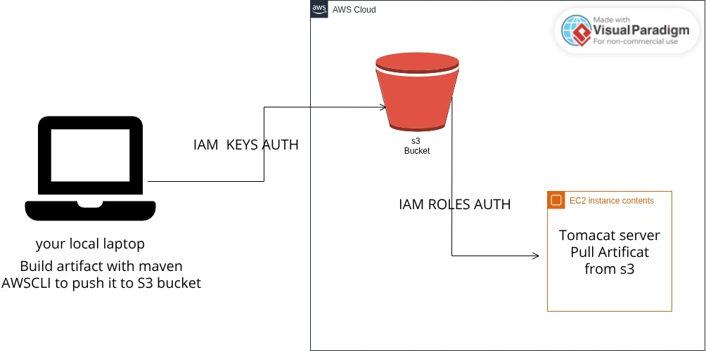
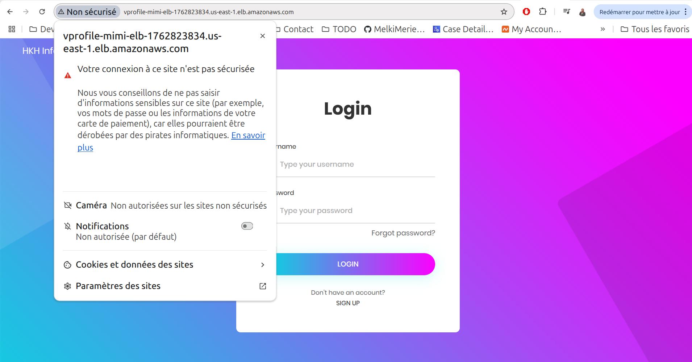
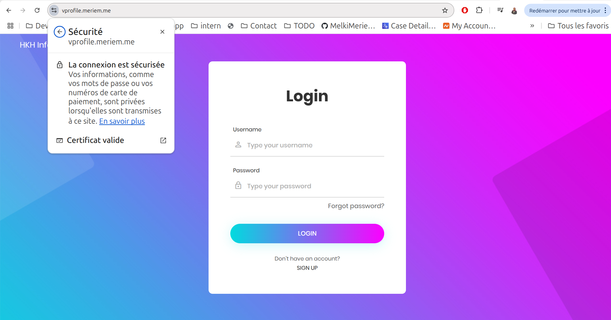

# Deploy Java Application on AWS 3‑Tier Architecture – Full Guide
**Lift and Shift Application Workload on AWS Cloud**

Welcome! This project walks through hosting and running a Java application on **AWS** using a **lift‑and‑shift strategy** suitable for production.

---

## Project Overview
You will provision a classic three‑tier stack (Load Balancer → App → Backend) and deploy a Java web app on EC2.

After completing this guide, you’ll understand how to run application workloads on AWS using a lift‑and‑shift approach and how to secure and automate the core building blocks.

---

## AWS Services Used
- **EC2 instances**: Tomcat (app tier), RabbitMQ, Memcached, MySQL (backend tier)
- **Elastic Load Balancer (ALB)**: Fronts the app tier
- **Auto Scaling**: Scales Tomcat instances
- **S3 / EFS**: Artifact or shared storage
- **Route 53**: Private DNS
- **ACM (AWS Certificate Manager)**: HTTPS certificates
- **IAM & EBS**: Supporting services

---

## Project Objectives
- Flexible, scalable infrastructure
- **Pay‑as‑you‑go** cost model
- Modernize via managed AWS services
- Emphasize **automation & IaC**

---

## Architectural Design
<p align="center">
  
</p>

- Users access a public URL (managed by your registrar/DNS provider, e.g., Namecheap).
- **ACM** issues TLS certificates; HTTPS terminates at the **Application Load Balancer**.
- The ALB routes requests to **Tomcat** instances in an **Auto Scaling Group** across subnets/AZs.
- Backend services (MySQL, Memcached, RabbitMQ) are reachable via **Route 53 private hosted zone** names.
- Security groups are separated for **Load Balancer**, **Application**, and **Backend** tiers.

---

## AWS Resources in Use
- **ACM** for SSL/TLS
- **EC2**: Tomcat, Memcached, RabbitMQ, MySQL
- **Route 53**: Private DNS
- **S3**: Artifact storage (WARs, configs, etc.)

---

# Index / Execution Flow

 [Project Overview](#project-overview)  
 [AWS Services Used](#aws-services-used)  
 [Project Objectives](#project-objectives)  
 [Architectural Design](#architectural-design)  

 . [Prerequisites](#prerequisites)  
   - [AWS CLI configuration](#prerequisites)  
   - [VPC and subnets](#prerequisites)  
   - [Public IP for SSH](#prerequisites)  
   - [Domain name](#prerequisites)  
   - [Export environment variables](#prerequisites)  

1. [Security Groups Setup](#security-groups-setup)  
   - [Load Balancer SG](#security-groups-setup)  
   - [Tomcat/App SG](#security-groups-setup)  
   - [Backend SG](#security-groups-setup)  

2. [EC2 Key Pair](#ec2-key-pair)  

3. [Launch EC2 Instances](#launch-ec2-instances)  
   - [Tomcat App Tier](#launch-ec2-instances)  
   - [MySQL Backend](#launch-ec2-instances)  
   - [Memcached](#launch-ec2-instances)  
   - [RabbitMQ](#launch-ec2-instances)  

4. [Private Hosted Zone & DNS](#private-hosted-zone--dns)  
   - [Create hosted zone](#private-hosted-zone--dns)  
   - [Create A records](#private-hosted-zone--dns)  
   - [Apply records](#private-hosted-zone--dns)  

5. [Build & Deploy Artifact](#build--deploy-artifact)  
    - [IAM user and role for S3](#build--deploy-artifact)  
    - [Build with Maven](#build--deploy-artifact)  
    - [Upload artifact to S3](#build--deploy-artifact)  
    - [Deploy to Tomcat](#build--deploy-artifact)  

6. [Load Balancer & ACM Configuration](#load-balancer--acm-configuration)  
    - [Create target group](#load-balancer--acm-configuration)  
    - [Create ALB](#load-balancer--acm-configuration)  
    - [Request ACM certificate](#load-balancer--acm-configuration)  
    - [DNS validation](#load-balancer--acm-configuration)  
    - [HTTP and HTTPS listeners](#load-balancer--acm-configuration)  

7. [Auto Scaling Group Setup](#auto-scaling-group-setup)  
    - [Create AMI from Tomcat](#auto-scaling-group-setup)  
    - [Create launch template](#auto-scaling-group-setup)  
    - [Create ASG](#auto-scaling-group-setup)  

8. [Verification & Testing](#verification--testing)  

9. [Key Takeaways](#key-takeaways)


---
# Prerequisites
- AWS CLI configured with appropriate permissions
- VPC and subnets created
- Your workstation’s public IP (for SSH)
- A domain name (you can purchase one from any registrar, or if you are a student, check the [GitHub Student Developer Pack](https://education.github.com/pack) for free domain options)

For convenience, export a few variables you’ll reuse:

```bash
export AWS_REGION=<your-aws-region>
export VPC_ID=<your-vpc-id>
export MY_IPv4_CIDR=<your-public-ipv4>/32   # e.g., 203.0.113.45/32

```

> Replace placeholders like `<your-vpc-id>` with your actual values before running commands.

---
## 1) Create Security groups 
### a) Create the Security Group for the **Load Balancer**
Allows HTTP/HTTPS from anywhere over IPv4 and IPv6.

```bash
# Create
SG_LB_ID=$(aws ec2 create-security-group \
  --group-name JavaApp-LoadBalancer-SG \
  --description "Allow HTTP and HTTPS from IPv4 and IPv6" \
  --vpc-id "$VPC_ID" \
  --query 'GroupId' --output text)

# (Optional) Tag it
aws ec2 create-tags --resources "$SG_LB_ID" \
  --tags Key=Name,Value=JavaApp-LoadBalancer-SG

# Ingress: 80/443 from everywhere (IPv4 + IPv6)
aws ec2 authorize-security-group-ingress \
  --group-id "$SG_LB_ID" \
  --ip-permissions '[
    {"IpProtocol":"tcp","FromPort":80,"ToPort":80,
     "IpRanges":[{"CidrIp":"0.0.0.0/0"}],
     "Ipv6Ranges":[{"CidrIpv6":"::/0"}]},
    {"IpProtocol":"tcp","FromPort":443,"ToPort":443,
     "IpRanges":[{"CidrIp":"0.0.0.0/0"}],
     "Ipv6Ranges":[{"CidrIpv6":"::/0"}]}
  ]'
```

---

### b) Create the Security Group for the **Tomcat (App Tier)**
Allows SSH from your IP, app ports from the ALB SG (preferred), and optional HTTP/8080 for testing.

```bash
# Create
SG_APP_ID=$(aws ec2 create-security-group \
  --group-name JavaApp-Tomcat-SG \
  --description "Tomcat app tier" \
  --vpc-id "$VPC_ID" \
  --query 'GroupId' --output text)

aws ec2 create-tags --resources "$SG_APP_ID" \
  --tags Key=Name,Value=JavaApp-Tomcat-SG

# Ingress rules
# - SSH from your workstation
# - 80/8080 from ALB SG (secure) – swap SG_LB_ID below after creation
# - (Optional) 8080 from 0.0.0.0/0 for quick tests – remove in production

aws ec2 authorize-security-group-ingress \
  --group-id "$SG_APP_ID" \
  --ip-permissions "[
    {\"IpProtocol\":\"tcp\",\"FromPort\":22,\"ToPort\":22,
     \"IpRanges\":[{\"CidrIp\":\"$MY_IPv4_CIDR\"}]},
    {\"IpProtocol\":\"tcp\",\"FromPort\":80,\"ToPort\":80,
     \"UserIdGroupPairs\":[{\"GroupId\":\"$SG_LB_ID\"}]},
    {\"IpProtocol\":\"tcp\",\"FromPort\":8080,\"ToPort\":8080,
     \"UserIdGroupPairs\":[{\"GroupId\":\"$SG_LB_ID\"}]}
  ]"

# (Optional – testing only)
# aws ec2 authorize-security-group-ingress \
#   --group-id "$SG_APP_ID" --protocol tcp --port 8080 --cidr 0.0.0.0/0
```

---

### c) Create the Security Group for the **Backend Tier**
Allows specific service ports from the app SG, SSH from your IP, and self‑reference for internal clustering/sync.

```bash
# Create
SG_BE_ID=$(aws ec2 create-security-group \
  --group-name JavaApp-Backend-SG \
  --description "Backend: MySQL, Memcached, RabbitMQ" \
  --vpc-id "$VPC_ID" \
  --query 'GroupId' --output text)

aws ec2 create-tags --resources "$SG_BE_ID" \
  --tags Key=Name,Value=JavaApp-Backend-SG

# Ingress: MySQL(3306), Memcached(11211), RabbitMQ(5672) from APP SG; SSH from your IP; self-ref for node-to-node traffic
aws ec2 authorize-security-group-ingress \
  --group-id "$SG_BE_ID" \
  --ip-permissions "[
    {\"IpProtocol\":\"tcp\",\"FromPort\":3306,\"ToPort\":3306,
     \"UserIdGroupPairs\":[{\"GroupId\":\"$SG_APP_ID\"}]},
    {\"IpProtocol\":\"tcp\",\"FromPort\":11211,\"ToPort\":11211,
     \"UserIdGroupPairs\":[{\"GroupId\":\"$SG_APP_ID\"}]},
    {\"IpProtocol\":\"tcp\",\"FromPort\":5672,\"ToPort\":5672,
     \"UserIdGroupPairs\":[{\"GroupId\":\"$SG_APP_ID\"}]},
    {\"IpProtocol\":\"tcp\",\"FromPort\":22,\"ToPort\":22,
     \"IpRanges\":[{\"CidrIp\":\"$MY_IPv4_CIDR\"}]},
    {\"IpProtocol\":\"-1\",\"UserIdGroupPairs\":[{\"GroupId\":\"$SG_BE_ID\"}]}
  ]"
```

> Note: Granting **All traffic** from the app SG to the backend SG is not recommended when you already open the specific ports. Keep access least‑privileged.

---

## 2) Create an **EC2 Key Pair**
Use this key to SSH into instances.

```bash
aws ec2 create-key-pair \
  --key-name JavaAppKey \
  --query 'KeyMaterial' \
  --output text > JavaAppKey.pem

chmod 400 JavaAppKey.pem
```

> Save the `.pem` securely. You can’t re‑download it later.

---

## Key Takeaways
- Demonstrates migrating a multi‑tier web application to AWS with **segregated security groups**.
- Uses EC2, ALB, Auto Scaling, S3, Route 53, and ACM.
- Emphasizes security (least privilege), scalability, and automation.

---
## 3) Launch 4 EC2 Instances

```bash
  # Variables
AMI_ID="ami-0c02fb55956c7d316"       # Amazon Linux 2 (update for your region)
KEY_NAME="JavaAppKey"

# Subnets (replace with your subnet IDs)
SUBNET_LB="subnet-xxxxxx"
SUBNET_APP1="subnet-xxxxxx"
SUBNET_APP2="subnet-xxxxxx"
SUBNET_BE="subnet-xxxxxx"
```
### a) Launch Tomcat instance :
```bash
# --- Launch Tomcat App Tier instances ---
aws ec2 run-instances \
  --image-id "$AMI_ID" \
  --count 1 \
  --instance-type t3.micro \
  --key-name "$KEY_NAME" \
  --security-group-ids "$SG_APP_ID" \
  --subnet-id "$SUBNET_APP1" \
  --tag-specifications 'ResourceType=instance,Tags=[{Key=Name,Value=JavaApp-Tomcat-1}]'
  --user-data file://tomcat-setup.sh
```

#### tomcat-setup.sh :
```bash
#!/bin/bash
sudo apt update
sudo apt upgrade -y
sudo apt install openjdk-17-jdk -y
sudo apt install tomcat10 tomcat10-admin tomcat10-docs tomcat10-common git -y

```
### b) Launch MySQL instance :
```bash

aws ec2 run-instances \
  --image-id "$AMI_ID" \
  --count 1 \
  --instance-type t3.micro \
  --key-name "$KEY_NAME" \
  --security-group-ids "$SG_BE_ID" \
  --subnet-id "$SUBNET_BE" \
  --tag-specifications 'ResourceType=instance,Tags=[{Key=Name,Value=JavaApp-MySQL}]'
  --user-data file://MySQL-setup.sh
```
#### MySQL-setup.sh :
```bash
#!/bin/bash
DATABASE_PASS='admin123'
sudo dnf update -y
sudo dnf install git zip unzip -y
sudo dnf install mariadb105-server -y
# starting & enabling mariadb-server
sudo systemctl start mariadb
sudo systemctl enable mariadb
cd /tmp/
git clone -b main https://github.com/hkhcoder/vprofile-project.git
#restore the dump file for the application
sudo mysqladmin -u root password "$DATABASE_PASS"
sudo mysql -u root -p"$DATABASE_PASS" -e "ALTER USER 'root'@'localhost' IDENTIFIED BY '$DATABASE_PASS'"
sudo mysql -u root -p"$DATABASE_PASS" -e "DELETE FROM mysql.user WHERE User='root' AND Host NOT IN ('localhost', '127.0.0.1', '::1')"
sudo mysql -u root -p"$DATABASE_PASS" -e "DELETE FROM mysql.user WHERE User=''"
sudo mysql -u root -p"$DATABASE_PASS" -e "DELETE FROM mysql.db WHERE Db='test' OR Db='test\_%'"
sudo mysql -u root -p"$DATABASE_PASS" -e "FLUSH PRIVILEGES"
sudo mysql -u root -p"$DATABASE_PASS" -e "create database accounts"
sudo mysql -u root -p"$DATABASE_PASS" -e "grant all privileges on accounts.* TO 'admin'@'localhost' identified by 'admin123'"
sudo mysql -u root -p"$DATABASE_PASS" -e "grant all privileges on accounts.* TO 'admin'@'%' identified by 'admin123'"
sudo mysql -u root -p"$DATABASE_PASS" accounts < /tmp/vprofile-project/src/main/resources/db_backup.sql
sudo mysql -u root -p"$DATABASE_PASS" -e "FLUSH PRIVILEGES"

```
### c) Launch Memcached instance :
```bash
  
aws ec2 run-instances \
  --image-id "$AMI_ID" \
  --count 1 \
  --instance-type t3.micro \
  --key-name "$KEY_NAME" \
  --security-group-ids "$SG_BE_ID" \
  --subnet-id "$SUBNET_BE" \
  --tag-specifications 'ResourceType=instance,Tags=[{Key=Name,Value=JavaApp-mq}]'
  --user-data file://memcache-setup.sh
```
#### memcache-setup.sh :
```bash
#!/bin/bash
sudo dnf install memcached -y
sudo systemctl start memcached
sudo systemctl enable memcached
sudo systemctl status memcached
sed -i 's/127.0.0.1/0.0.0.0/g' /etc/sysconfig/memcached
sudo systemctl restart memcached
sudo memcached -p 11211 -U 11111 -u memcached -d

```
### c) Launch RabbitMQ instance :

```bash
  
aws ec2 run-instances \
  --image-id "$AMI_ID" \
  --count 1 \
  --instance-type t3.micro \
  --key-name "$KEY_NAME" \
  --security-group-ids "$SG_BE_ID" \
  --subnet-id "$SUBNET_BE" \
  --tag-specifications 'ResourceType=instance,Tags=[{Key=Name,Value=JavaApp-rmq}]'
  --user-data file://rabbitmqt-setup.sh

```
#### rabbitmqt-setup.sh :
```bash
#!/bin/bash
## primary RabbitMQ signing key
rpm --import 'https://github.com/rabbitmq/signing-keys/releases/download/3.0/rabbitmq-release-signing-key.asc'
## modern Erlang repository
rpm --import 'https://github.com/rabbitmq/signing-keys/releases/download/3.0/cloudsmith.rabbitmq-erlang.E495BB49CC4BBE5B.key'
## RabbitMQ server repository
rpm --import 'https://github.com/rabbitmq/signing-keys/releases/download/3.0/cloudsmith.rabbitmq-server.9F4587F226208342.key'
curl -o /etc/yum.repos.d/rabbitmq.repo https://raw.githubusercontent.com/hkhcoder/vprofile-project/refs/heads/awsliftandshift/al2023rmq.repo
dnf update -y
## install these dependencies from standard OS repositories
dnf install socat logrotate -y
## install RabbitMQ and zero dependency Erlang
dnf install -y erlang rabbitmq-server
systemctl enable rabbitmq-server
systemctl start rabbitmq-server
sudo sh -c 'echo "[{rabbit, [{loopback_users, []}]}]." > /etc/rabbitmq/rabbitmq.config'
sudo rabbitmqctl add_user test test
sudo rabbitmqctl set_user_tags test administrator
rabbitmqctl set_permissions -p / test ".*" ".*" ".*"

sudo systemctl restart rabbitmq-server

```
## 4) Create a Private Hosted Zone
### a) Create a private hosted zone
```bash
aws route53 create-hosted-zone \
    --name example.com \
    --caller-reference "$(date +%s)" \
    --vpc VPCRegion=us-east-1,VPCId=vpc-xxxxxxxx \
    --hosted-zone-config Comment="Private example.com zone",PrivateZone=true
```
### b) Create A records in that hosted zone
```bash

cat > records.json <<EOL
{
  "Comment": "Create A records for example.com",
  "Changes": [
    {
      "Action": "CREATE",
      "ResourceRecordSet": {
        "Name": "app01.example.com",
        "Type": "A",
        "TTL": 300,
        "ResourceRecords": [{"Value": "Private ip of the Tomcat instance"}]
      }
    },
    {
      "Action": "CREATE",
      "ResourceRecordSet": {
        "Name": "db01.example.com",
        "Type": "A",
        "TTL": 300,
        "ResourceRecords": [{"Value": "Private ip of the MySQL instance"}]
      }
    },
    {
      "Action": "CREATE",
      "ResourceRecordSet": {
        "Name": "mc01.example.com",
        "Type": "A",
        "TTL": 300,
        "ResourceRecords": [{"Value": "Private ip of the MemeCache instance"}]
      }
    },
    {
      "Action": "CREATE",
      "ResourceRecordSet": {
        "Name": "rmq01.example.com",
        "Type": "A",
        "TTL": 300,
        "ResourceRecords": [{"Value": "Private ip of the RabbitMQ instance"}]
      }
    }
  ]
}
EOL

```
### c) Apply the records to the hosted zone
```bash
aws route53 change-resource-record-sets \
    --hosted-zone-id <HOSTED_ZONE_ID> \
    --change-batch file://records.json

```
## 5) Build and deploy artifact :

### Architectural Design : 
<p align="center">
  
</p>
### a) Create an IAM user :
```bash
# Create the IAM user
aws iam create-user --user-name vprofile-s3-admin

# Create access keys
aws iam create-access-key --user-name vprofile-s3-admin

# Attach AmazonS3FullAccess policy
aws iam attach-user-policy \
    --user-name vprofile-s3-admin \
    --policy-arn arn:aws:iam::aws:policy/AmazonS3FullAccess

```
### b) Create an IAM role :
```bash
# Create trust policy JSON
echo '{
  "Version": "2012-10-17",
  "Statement": [
    {
      "Effect": "Allow",
      "Principal": {
        "Service": "ec2.amazonaws.com"
      },
      "Action": "sts:AssumeRole"
    }
  ]
}' > trust-policy.json

# Create the IAM role
aws iam create-role \
    --role-name s3-admin \
    --assume-role-policy-document file://trust-policy.json \
    --description "Allows EC2 instances to call AWS services on your behalf"

# Attach AmazonS3FullAccess policy
aws iam attach-role-policy \
    --role-name s3-admin \
    --policy-arn arn:aws:iam::aws:policy/AmazonS3FullAccess

# Create instance profile
aws iam create-instance-profile --instance-profile-name s3-admin

# 5Add role to instance profile
aws iam add-role-to-instance-profile \
    --instance-profile-name s3-admin \
    --role-name s3-admin

# Cleanup temporary trust policy file
rm trust-policy.json

```
### c) Build an artifact with Maven :
###### You can use the vprofile java app existed in my repo .
```bash
# go to your project directory , and run this command in the terminal :
mvn clean install
```
### d) Put the artifact in the S3 bucket :
```bash
aws configure
#tap your Acces key and your Secret key .
aws s3 mv /path/to/local/project.jar s3://your-bucket-name/ 
```
### e) Open the Tomcat instance and deploy the artifcat :
```bash
# Connect to your Tomcat server
ssh ec2-user@<TOMCAT_SERVER_IP>

# Navigate to the Tomcat webapps directory
cd /path/to/tomcat/webapps
# Download the artifact from S3
aws s3 cp s3://your-bucket-name/project.jar .

# Deploy by renaming to ROOT.war (if you want it as the default app)
mv project.jar ROOT.war

# Restart Tomcat to pick up the new artifact
sudo systemctl restart tomcat

```
## 6) Load Balancer and DNS 

### a) Make a target group :
```bash
aws elbv2 create-target-group \
      --name JavaApp-tg \
    --protocol HTTP \
    --port 80 \
    --vpc-id <yout-vpc-id> \
    --target-type instance \
    --health-check-protocol HTTP \
    --health-check-port 80 \
    --health-check-path /
```
### b) Create The Load Balancer :
```bash
aws elbv2 create-load-balancer \
    --name JavaApp-elb \
    --subnets subnet-0c6cc0c6bb9d19d6e subnet-0b2ec8e01612c4b99 subnet-0931ccb6861b28e61 subnet-04697938f795e023e subnet-0d5c1083a14596ea3 subnet-0bf676b6afe129174 \
    --scheme internet-facing \
    --type application \
    --ip-address-type ipv4
```
### c) Create an ACM certificate  :

```bash
aws acm request-certificate \
    --domain-name "*.example.com" \
    --validation-method DNS \
    --tags Key=Name,Value=example-cert
```
### d) Get the DNS validation record : 
```bash
aws acm describe-certificate \
    --certificate-arn <CERTIFICATE_ARN>
```
#### Look for
```bash
Name: _xxxxxxxxxxxx.example.com
Value: _yyyyyyyyyyyy.acm-validations.aws
```
###### These are the CNAME records needed for validation.
#### Add this cname record to your domain provider ( NameCheap in my case )
### e) Create the DNS validation record in Route 53  :
```bash
aws route53 change-resource-record-sets \
    --hosted-zone-id <HOSTED_ZONE_ID> \
    --change-batch '{
      "Changes": [
        {
          "Action": "CREATE",
          "ResourceRecordSet": {
            "Name": "_xxxxxxxxxxxx.example.com",
            "Type": "CNAME",
            "TTL": 300,
            "ResourceRecords": [{"Value": "_yyyyyyyyyyyy.acm-validations.aws"}]
          }
        }
      ]
    }'

```
### f) Wait for validation  :
```bash
aws acm wait certificate-validated \
    --certificate-arn <CERTIFICATE_ARN>
```
### g) Create HTTP listener (port 80) :
```bash
aws elbv2 create-listener \
    --load-balancer-arn <LOAD_BALANCER_ARN> \
    --protocol HTTP \
    --port 80 \
    --default-actions Type=forward,TargetGroupArn=<TARGET_GROUP_ARN>

```
### h) Create HTTPS listener (port 443) with SSL certificate :
```bash
aws elbv2 create-listener \
    --load-balancer-arn <LOAD_BALANCER_ARN> \
    --protocol HTTPS \
    --port 443 \
    --certificates CertificateArn=<CERTIFICATE_ARN> \
    --default-actions Type=forward,TargetGroupArn=<TARGET_GROUP_ARN> \
    --ssl-policy ELBSecurityPolicy-TLS-1-2-2017-01

```

## 7) Autoscaling Group
### a) Create an image of the tomcat instance :
```bash
aws ec2 create-image \
    --instance-id <INSTANCE_ID> \
    --name "JavaApp-ami" \
    --description "Application server AMI" \
    --no-reboot

```
### b) Create a launch template :
```bash
aws ec2 create-launch-template \
  --launch-template-name JavaApp-LT \
  --version-description "v1" \
  --launch-template-data '{
    "ImageId": "<AMI_ID>",
    "InstanceType": "t2.micro",
    "SecurityGroupIds": ["<SECURITY_GROUP_ID_Of_TOMCAT_Instance>"],
    "KeyName": "<KEY_PAIR_NAME>"
  }'
```
### c) Create an autoscaling group :
```bash
aws autoscaling create-auto-scaling-group \
  --auto-scaling-group-name JavaApp-ASG \
  --launch-template "LaunchTemplateName=JavaApp-LT,Version=1" \
  --min-size 2 \
  --max-size 5 \
  --desired-capacity 2 \
  --vpc-zone-identifier "<SUBNET_ID_1>,<SUBNET_ID_2>" \
  --target-group-arns "<TARGET_GROUP_ARN>"
```
## 8) Verification & Testing

After deploying the Java application, you can verify access in three ways:

### a) Access via Tomcat Public IP (Not Recommended)
- Use the public IP of the Tomcat instance directly.
- This does **not** use the load balancer or HTTPS.
- Example URL: `http://<TOMCAT_PUBLIC_IP>:8080

<p align="center">
  
</p>

### b) Access via Load Balancer DNS (HTTP, Not Secure)
- Use the Application Load Balancer DNS name over HTTP.
- Traffic passes through ALB but is **not encrypted**.
- Example URL: `Dans name of the load balancer`

<p align="center">
  
</p>
---

### c) Access via Load Balancer DNS (HTTPS, Secure)
- Use the ALB DNS name with HTTPS, secured by ACM certificate.
- Example URL: `https:appname.domain.com`

<p align="center">
  
</p>
> ✅ **Tip:** Always use the HTTPS URL in production for security.


## 9) [Key Takeaways](#key-takeaways)
