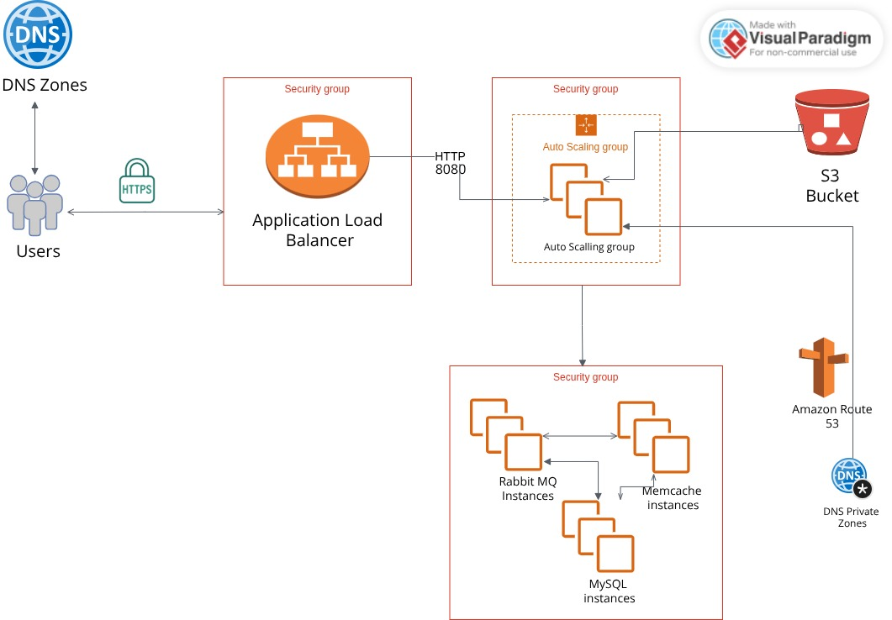

# Deploy Java Application on AWS 3-Tier Architecture - Full Guide
**Lift and Shift Application Workload on AWS Cloud**

Welcome to the project. This is an AWS cloud computing project.
---

## Project Overview
In this project, we will host and run a Java app on **AWS cloud** for production using a **lift and shift strategy**.

After completing this project, you will learn how to run application workloads on AWS cloud using the **lift and shift strategy**.

---

## AWS Services Used
Key AWS services in this project:

- **EC2 instances**: For Tomcat, RabbitMQ, Memcache, and MySQL servers
- **Elastic Load Balancer (ELB)**: To distribute traffic
- **Auto Scaling**: To automatically scale EC2 instances
- **S3 / EFS**: For storage
- **Route 53**: Private DNS service
- **ACM (Amazon Certificate Manager)**: For HTTPS certificates
- **IAM and EBS**: Additional supporting services

---

## Project Objectives
- Achieve a flexible infrastructure
- Adopt a **pay-as-you-go** model
- Modernize the application using AWS services
- Implement **automation and infrastructure as code**

---

## Architectural Design

  

- Users access the website via a URL.
- The URL points to an endpoint managed by **NameCheap DNS** .
- **HTTPS** certificates are handled by ACM.
- Requests are routed via the **Application Load Balancer** to Tomcat instances.
- Tomcat instances run in an **Auto Scaling group**.
- Backend servers (MySQL, Memcache, RabbitMQ) use **Route 53 private DNS zones**.
- Security groups are segregated for load balancer, application, and backend servers.

---

## AWS Resources in Use
- **Amazon Certificate Manager**: SSL certificates
- **EC2 instances**: Tomcat, Memcache, RabbitMQ, MySQL
- **Amazon Route 53**: Private DNS zones
- **Amazon S3**: Artifact storage

---

## Execution Flow
1. Log into AWS account
2. Create **key pairs** for EC2 login
3. Create **security groups** for load balancer, Tomcat, and backend
4. Launch EC2 instances with **user data scripts**
5. Update IP-to-name mappings in Route 53
6. Build application locally and upload to S3
7. Download artifact from S3 to Tomcat instances
8. Set up **Application Load Balancer** with HTTPS
9. Map load balancer to website in GoDaddy DNS
10. Build **Auto Scaling group** for Tomcat

---

## Key Takeaways
- Demonstrates migrating a multi-tier web application to AWS using **lift and shift**
- Shows usage of EC2, ELB, Auto Scaling, S3, Route 53, and ACM
- Highlights advantages of cloud computing: flexibility, scalability, cost control, and automation
- Architecture involves **segregated security groups** and DNS management via Route 53
